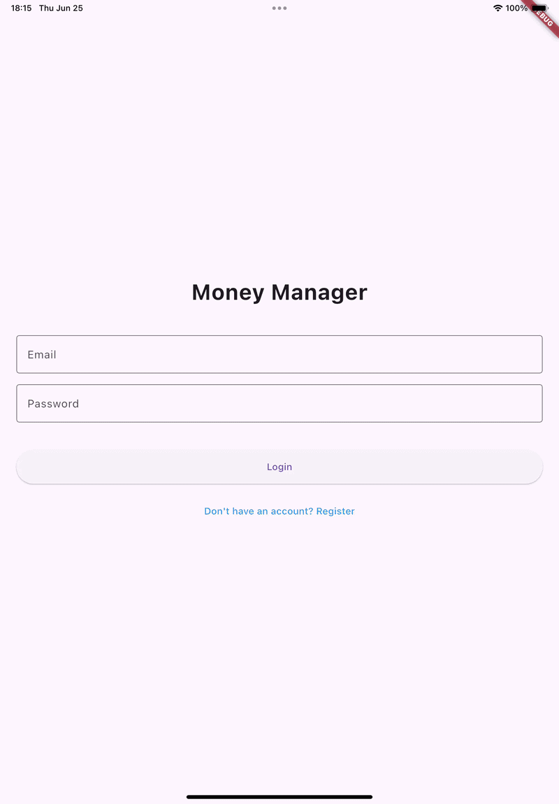
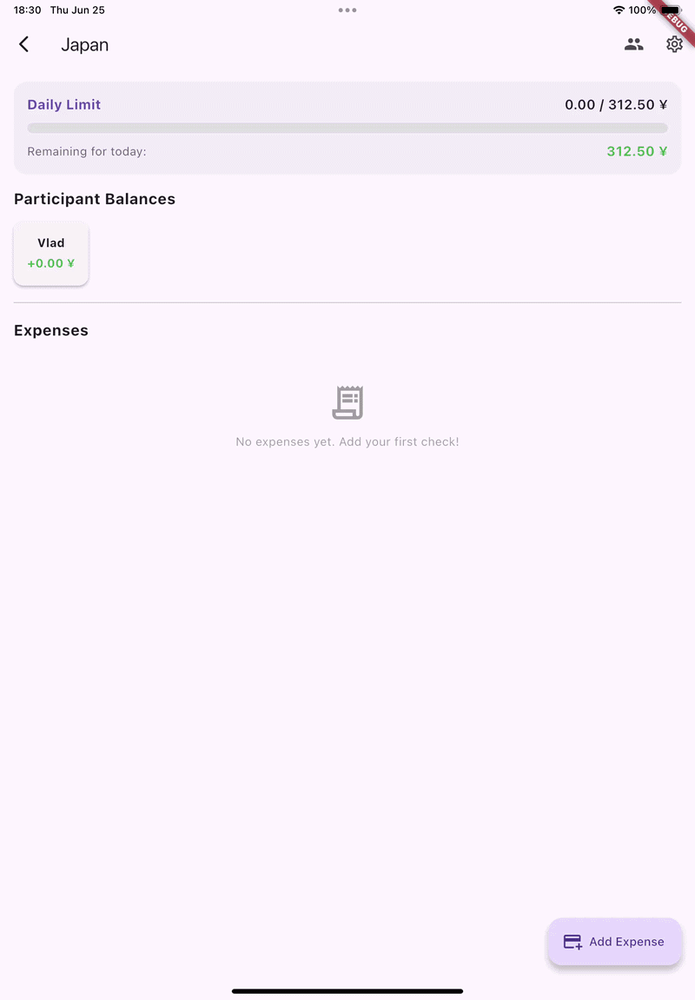
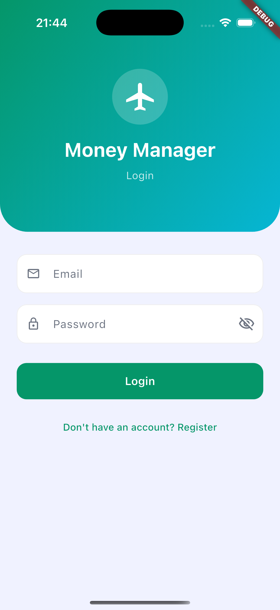
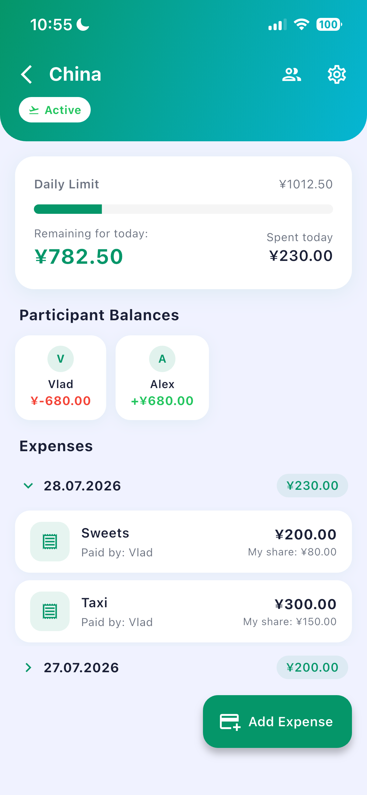
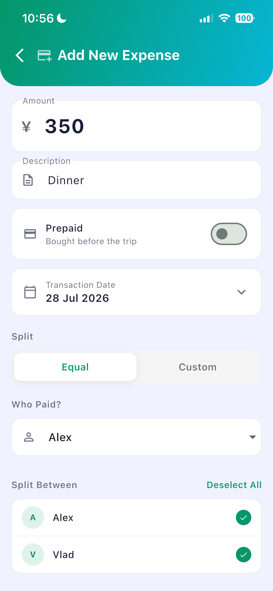

<p align="center">
  <h1 align="center">💸 Money Manager</h1>
</p>

<p align="center">
  
  
  
  
  
</p>

<p align="center">
  <b><a href="https://github.com/s1zyy/money_manager_backend">⚙️ Backend (Spring Boot)</a></b> •
  <b><a href="#architecture">Architecture</a></b> •
  <b><a href="#quick-start">Quick Start</a></b>
</p>

---

## About

**Money Manager** is a cross-platform mobile app that makes splitting trip expenses effortless. Create a trip, invite friends via a unique code, log expenses, and let the app automatically calculate who owes whom.

Think Splitwise, but built from scratch with a clean Flutter architecture and a Spring Boot backend.

---

## Demo

<table align="center">
  <tr>
    <th align="center">App Walkthrough</th>
    <th align="center">Adding an Expense</th>
  </tr>
  <tr>
    <td align="center">
      
    </td>
    <td align="center">
      
    </td>
  </tr>
</table>

---

## Screenshots

<table align="center">
  <tr>
    <td align="center"><br/><sub>Login</sub></td>
    <td align="center"><br/><sub>My Trips</sub></td>
    <td align="center"><br/><sub>Trip Details</sub></td>
    <td align="center"><br/><sub>Add Expense</sub></td>
  </tr>
</table>

---

## Features

| | Feature |
|---|---|
| 🔐 | JWT authentication — register & login |
| ✈️ | Create and manage group trips |
| 🔗 | Join trips via shareable invite codes |
| 💰 | Add expenses split across any participants |
| 📊 | Live balance dashboard — see debts in real time |
| 🗂️ | Archive completed trips |
| 🌐 | Localization — EN / RU |
| 📱 | Runs on iOS & Android |

---

## Architecture

Clean Architecture in Flutter — each layer has one responsibility and only depends on layers closer to the domain:

```
lib/
│
├── domain/                  ← Pure Dart, zero Flutter dependencies
│   ├── entities/            # Trip, Expense, TripDashboard, AuthResult
│   ├── repositories/        # Abstract interfaces
│   └── usecases/            # One class = one operation
│       ├── auth/            # Login, Register, Logout
│       ├── trip/            # CreateTrip, JoinTrip, ArchiveTrip…
│       └── expenses/        # AddExpense, UpdateExpense, DeleteExpense…
│
├── data/                    ← Implements domain interfaces
│   ├── models/              # JSON serialization (fromJson / toJson)
│   ├── datasources/         # Dio HTTP calls + FlutterSecureStorage
│   └── repositories/        # Repository implementations
│
├── presentation/            ← UI layer
│   ├── pages/               # LoginPage, MainPage, TripDetailsPage…
│   └── providers/           # AuthProvider, TripsProvider, TripDashboardProvider
│
├── core/                    ← Shared infrastructure
│   ├── dio_client.dart      # Base URL, timeout config
│   └── auth_interceptor.dart# Injects JWT into every request
│
└── injection_container.dart  ← GetIt DI wiring (all registrations in one place)
```

**Key decisions:**
- **GetIt** for dependency injection — `sl<T>()` anywhere, no `BuildContext` threading required
- **Provider** (`ChangeNotifier`) for UI state — `AuthProvider` and `TripsProvider` are lazy singletons, `TripDashboardProvider` is a factory (new instance per trip)
- **AuthInterceptor** auto-attaches the JWT from `FlutterSecureStorage` to every Dio request
- Base URL is platform-conditional: `localhost:8080` on iOS, `10.0.2.2:8080` on Android emulator

---

## Tech Stack

| | Technology |
|---|---|
| Language | Dart 3 |
| Framework | Flutter 3 |
| State management | Provider + ChangeNotifier |
| Dependency injection | GetIt |
| HTTP client | Dio 5 |
| Secure storage | FlutterSecureStorage |
| Localization | flutter_localizations (EN / RU) |
| ID generation | uuid |

---

## Quick Start

**Prerequisites:** Flutter SDK 3.x, running backend (see [backend repo](https://github.com/s1zyy/money_manager_backend))

```bash
# 1. Clone
git clone https://github.com/s1zyy/money_manager.git
cd money_manager/flutter

# 2. Install dependencies
flutter pub get

# 3. Run on iOS simulator
flutter run

# 4. Run on Android emulator (uses 10.0.2.2 to reach host machine)
flutter run -d android
```

Make sure the backend is running on `localhost:8080` before starting the app.

```bash
# Static analysis
flutter analyze

# Tests
flutter test
```

---

## Project Structure — Pages

| Page | Description |
|---|---|
| `LoginPage` | Email + password login |
| `RegisterPage` | New account creation |
| `MainPage` | List of user's trips |
| `CreateTripPage` | New trip form (name, dates, budget) |
| `TripDetailsPage` | Expenses list + balance dashboard |
| `AddExpensePage` | Add / edit an expense with participant selection |
| `TripSettingsPage` | Trip info, participants, archive / leave |

---

## Backend

This app requires the REST API from the companion backend:

**[⚙️ money_manager_backend](https://github.com/s1zyy/money_manager_backend)** — Spring Boot 4, Java 21, PostgreSQL

```
┌─────────────────────────┐
│  Flutter App (this repo) │ ◄── you are here
└────────────┬────────────┘
             │ HTTP / REST
┌────────────▼────────────┐
│     Spring Boot API      │
└────────────┬────────────┘
             │ JDBC
┌────────────▼────────────┐
│      PostgreSQL 15       │
└─────────────────────────┘
```

---

## License

Custom License — see [LICENSE](LICENSE)
